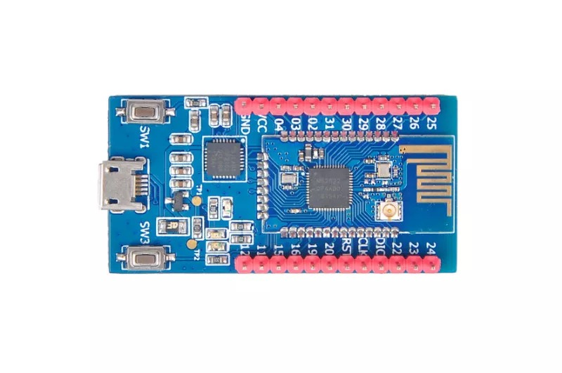

.. _nrf52832_breakout:

nRF52832-Breakout
##############

Overview
********

Zephyr applications run on the nrf52832_breakout hardware(board). It provides
support for the Nordic Semiconductor nRF52832 ARM Cortex-M4F CPU and
the following devices:

* :abbr:`NVIC (Nested Vectored Interrupt Controller)`
* :abbr:`RTC (nRF RTC System Clock)`
* UART
* GPIO
* FLASH
* RADIO (Bluetooth Low Energy)
* Segger RTT (RTT Console)

     nRF52 nrf52832 mini dev board

Hardware
********

nrf52832_breakout has two external oscillators. The frequency of
the slow clock is 32.768 kHz. The frequency of the main clock
is 32 MHz.

Supported Features
==================

The nrf52832_breakout board configuration supports the following
hardware features:

+-----------+------------+----------------------+
| Interface | Controller | Driver/Component     |
+===========+============+======================+
| NVIC      | on-chip    | nested vectored      |
|           |            | interrupt controller |
+-----------+------------+----------------------+
| RTC       | on-chip    | system clock         |
+-----------+------------+----------------------+
| UART      | on-chip    | serial port          |
+-----------+------------+----------------------+
| GPIO      | on-chip    | gpio                 |
+-----------+------------+----------------------+
| FLASH     | on-chip    | flash                |
+-----------+------------+----------------------+
| RADIO     | on-chip    | Bluetooth            |
+-----------+------------+----------------------+
| RTT       | on-chip    | console              |
+-----------+------------+----------------------+

Other hardware features are not supported by the Zephyr kernel.

Connections and IOs
===================

LED
---

* LED1 (red) = P0.17
* LED2 (red) = P0.18

Push buttons
------------

* BUTTON1 = SW1 = P0.13
* BUTTON2 = SW2 = P0.14

External Connectors
-------------------

* onboard CP2102 chip

Programming and Debugging
*************************

Flashing
========

Follow the instructions in the :ref:`nordic_segger` page to install
and configure all the necessary software. Further information can be
found in :ref:`nordic_segger_flashing`. Then build and flash
applications as usual (see :ref:`build_an_application` and
:ref:`application_run` for more details).

Here is an example for the :ref:`hello_world` application.

First, run your favorite terminal program to listen for output.

.. code-block:: console

   $ minicom -D <tty_device> -b 115200

Replace :code:`<tty_device>` with the port where the board nrf52832_breakout
can be found. For example, under Linux, :code:`/dev/ttyUSB0`.

Then build and flash the application in the usual way.

.. zephyr-app-commands::
   :zephyr-app: samples/hello_world
   :board: nrf52832_breakout
   :goals: build flash

Debugging
=========

Refer to the :ref:`nordic_segger` page to learn about debugging Nordic boards with a
Segger IC.

Testing the LEDs and buttons in the nrf52832_breakout
********************************************

There are 2 samples that allow you to test that the buttons (switches) and LEDs on
the board are working properly with Zephyr:

.. code-block:: console

   samples/basic/blinky
   samples/basic/button

You can build and flash the examples to make sure Zephyr is running correctly on
your board. The button and LED definitions can be found in :file:`boards/arm/nrf52832_breakout/board.h`.

